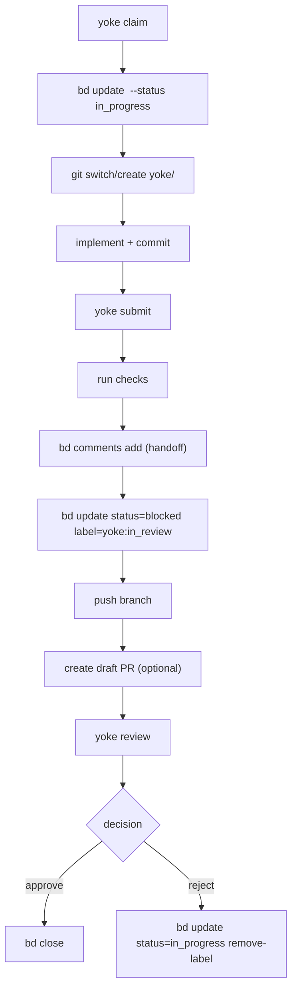

# How yoke Works

This document explains yoke’s execution model and internal command flow.

## Design goals

- agent-first command UX
- explicit task-state transitions
- minimal automation with strong boundaries
- deterministic behavior over implicit magic

## System model

`yoke` coordinates five systems:

1. `bd` for task lifecycle
2. `git` for branch isolation
3. `gh` for PR boundary (optional)
4. local check command for quality gate
5. optional writer/reviewer shell commands for daemon automation

## Lifecycle mapping

High-level state progression:

```text
open -> in_progress -> blocked+yoke:in_review -> closed or in_progress
```

Command mapping:

- `yoke status` -> read-only snapshot (`git rev-parse`, branch-derived focus, next ready issue)
- `yoke daemon` -> loop (review queue -> in_progress -> next ready open issue)
- `yoke claim` -> `bd update <issue> --status in_progress`
- `yoke submit` -> `bd comments add` + `bd update --status blocked --add-label yoke:in_review`
- `yoke review --approve` -> `bd close`
- `yoke review --reject` -> `bd update --status in_progress --remove-label yoke:in_review`

## Execution flow diagram



## Command internals

### `init`

- Ensures scaffold directories exist.
- Prompts for a bd issue prefix (`YOKE_BD_PREFIX`).
- Detects available agents by searching PATH for:
  - `codex`
  - `claude` or `claude-code`
- In interactive mode, prompts for writer/reviewer choices.
- Writes normalized config values to `.yoke/config.sh`.

### `doctor`

- Validates required/optional tool availability.
- Reports configured writer/reviewer agent availability.
- Returns non-zero when required dependencies fail.

### `status`

- Prints parseable key/value snapshot fields for agents.
- Includes current branch, `bd_focus`/`bd_next`, configured agents, and tool availability.
- Is read-only and safe to run before any lifecycle command.

### `daemon`

- Executes an automatic loop with action priority:
  1. review first (`bd list --status blocked --label yoke:in_review`)
  2. write next (focused or `in_progress`)
  3. claim next open issue (`bd list --status open --ready`)
  4. idle when no actionable issues remain
- If `--max-iterations` is hit while work is still `in_progress` or `in_review`, emits a no-consensus notification and keeps PR draft/open.
- Runs `YOKE_WRITER_CMD` and `YOKE_REVIEW_CMD` with issue context env vars.
- Verifies each role command advances bd state to prevent no-op infinite loops.

### `claim`

- Resolves target issue (explicit or first `bd list --status open --ready`) using `YOKE_BD_PREFIX`.
- If target is an epic, resolves claim target to an epic child task:
  - prefers an existing `in_progress` child task
  - otherwise selects a ready open child task
  - closes the epic automatically when all child tasks are closed
- Calls `bd update <issue> --status in_progress --remove-label yoke:in_review`.
- Moves repository to task branch `yoke/<bd-id>`.

### `submit`

- Resolves issue ID from argument or current branch using `YOKE_BD_PREFIX`.
- Runs configurable quality checks.
- Writes a handoff note via `bd comments add`.
- Marks task as review-ready by setting `blocked` + `yoke:in_review`.
- Optionally pushes and opens/updates PR path.
- Posts a writer handoff comment to the branch PR by default.

### `review`

- Resolves issue ID from argument or review queue (`blocked` + `yoke:in_review`) using `YOKE_BD_PREFIX`.
- Optionally runs reviewer command hook (`YOKE_REVIEW_CMD`).
- Optionally attaches note (`bd comments add`).
- Applies final decision (`bd close` or `bd update --status in_progress --remove-label yoke:in_review`).
- Posts reviewer updates to the branch PR for approve/reject/note actions by default.
- On approve, automatically marks the issue PR ready for review when it is currently draft.

## PR behavior

`yoke submit` creates PRs only when:
- `gh` exists
- `origin` remote exists
- no open PR already exists for current branch

When an open PR exists for the current branch:
- `yoke submit` posts writer handoff summaries as PR comments.
- `yoke review` posts reviewer decisions and notes as PR comments.

Otherwise it logs a skip reason and continues.

## Error model

`yoke` exits early on first hard failure.
Typical hard failures:
- missing required tools (`bd`, `git`)
- missing required flags (`submit --done`, `submit --remaining`)
- unresolved issue id
- failing check command

Typical soft skips:
- missing `gh`
- missing `origin`
- existing open PR

## Agent-oriented interface guarantees

- Every command has explicit `--help` output.
- Help text includes purpose, side effects, options, and examples.
- `yoke help <command>` offers deterministic help retrieval.

This is intentional to maximize reliability for LLM-driven execution.
